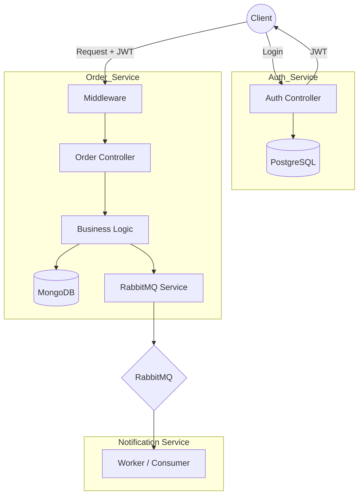

# 🚀 Service Order System, Event-Driven Architecture

---

## 🧭 Architecture Overview




---

## 📑 Table of Contents

* [Architecture Overview](#architecture-overview)
* [Architecture and Infrastructure](#architecture-and-infrastructure)
* [Solution Components](#solution-components)
* [Docker Orchestration](#docker-orchestration)
* [Data Flow and Messaging](#data-flow-and-messaging)
* [How to Run](#how-to-run)
* [Project Goals](#project-goals)
* [Technical Decisions](#technical-decisions)
* [Planned Improvements](#planned-improvements)
* [About the Project](#about-the-project)

---

## 🏗️ Architecture and Infrastructure

This application follows a microservices architecture with asynchronous communication based on events. Messaging is used to decouple services and improve scalability.

Each service has a single responsibility and can evolve independently.

---

## 🧱 Solution Components

### 📦 Order Service (Node.js + TypeScript)

* Database: MongoDB (NoSQL)

Responsible for creating service orders, persisting data, and publishing events.

---

### 🔐 Auth Service (Node.js + TypeScript)

* Database: PostgreSQL

Responsible for authentication and user management.

---

### 📡 Message Broker

* RabbitMQ

Handles asynchronous communication between services.

---

### 🔔 Notification Service (In progress)

Will consume events and process notifications.

---

## 🐳 Docker Orchestration

```yaml
services:
  rabbitmq:
    image: rabbitmq:3-management
    ports:
      - "5672:5672"
      - "15672:15672"

  mongodb:
    image: mongo
    ports:
      - "27017:27017"
```

---

## 🔄 Data Flow and Messaging

1. Client creates a service order
2. Order Service saves data to MongoDB
3. Event is published to RabbitMQ
4. (Future) Notification Service consumes the event

---

## 🛠️ How to Run

```bash
docker-compose up -d
```

```bash
npm install
npm run dev
```

---

## 🎯 Project Goals

* Microservices architecture
* Event-driven communication (pub/sub)
* RabbitMQ messaging
* MongoDB + PostgreSQL
* Docker containerization

---

## 💡 Technical Decisions

* MongoDB → flexibility for dynamic data
* PostgreSQL → consistency for relational data
* RabbitMQ → decoupling and reliability
* Docker → environment standardization

---

## 📈 Planned Improvements

* Notification Service implementation
* Retry and dead-letter queues
* Observability (logs and metrics)
* Kubernetes deployment
* Redis for caching

---

## 👩‍💻 About the Project

This project was built as a practical approach to learning and applying modern backend architecture concepts, focusing on scalability, decoupling, and real-world scenarios.

---

🚀 Continuously evolving.

---

# 🇧🇷 Sistema de Ordens de Serviço, Arquitetura Event-Driven

---

## 🧭 Visão Geral da Arquitetura


---

## 📑 Sumário

* [Visão Geral da Arquitetura](#visão-geral-da-arquitetura)
* [Arquitetura e Infraestrutura](#arquitetura-e-infraestrutura)
* [Componentes da Solução](#componentes-da-solução)
* [Orquestração com Docker](#orquestração-com-docker)
* [Fluxo de Dados e Mensageria](#fluxo-de-dados-e-mensageria)
* [Como Executar o Projeto](#como-executar-o-projeto)
* [Objetivos do Projeto](#objetivos-do-projeto)
* [Decisões Técnicas](#decisões-técnicas)
* [Evoluções Planejadas](#evoluções-planejadas)
* [Sobre o Projeto](#sobre-o-projeto)

---

## 🏗️ Arquitetura e Infraestrutura

A aplicação segue o padrão de microsserviços com comunicação assíncrona baseada em eventos, utilizando mensageria para desacoplamento entre os serviços.

Cada serviço possui responsabilidade única e pode evoluir de forma independente.

---

## 🧱 Componentes da Solução

### 📦 Order Service (Node.js + TypeScript)

* Banco: MongoDB (NoSQL)

Responsável por criar ordens de serviço, persistir dados e publicar eventos.

---

### 🔐 Auth Service (Node.js + TypeScript)

* Banco: PostgreSQL

Responsável pela autenticação e gestão de usuários.

---

### 📡 Message Broker

* RabbitMQ

Responsável pela comunicação assíncrona entre os serviços.

---

### 🔔 Notification Service (Em desenvolvimento)

Consumirá eventos e processará notificações.

---

## 🐳 Orquestração com Docker

```yaml
services:
  rabbitmq:
    image: rabbitmq:3-management
    ports:
      - "5672:5672"
      - "15672:15672"

  mongodb:
    image: mongo
    ports:
      - "27017:27017"
```

---

## 🔄 Fluxo de Dados e Mensageria

1. Cliente cria uma ordem de serviço
2. Order Service salva no MongoDB
3. Evento é publicado no RabbitMQ
4. (Futuro) Notification Service consome o evento

---

## 🛠️ Como Executar o Projeto

```bash
docker-compose up -d
```

```bash
npm install
npm run dev
```

---

## 🎯 Objetivos do Projeto

* Microsserviços
* Event-driven (pub/sub)
* RabbitMQ
* MongoDB + PostgreSQL
* Docker

---

## 💡 Decisões Técnicas

* MongoDB → flexibilidade
* PostgreSQL → consistência
* RabbitMQ → desacoplamento
* Docker → padronização

---

## 📈 Evoluções Planejadas

* Notification Service
* Retry / DLQ
* Observabilidade
* Kubernetes
* Redis

---

## 👩‍💻 Sobre o Projeto

Projeto desenvolvido com foco em aprendizado prático e simulação de cenários reais de backend.

---

🚀 Em constante evolução.
